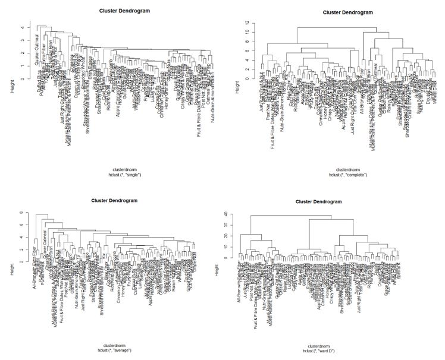
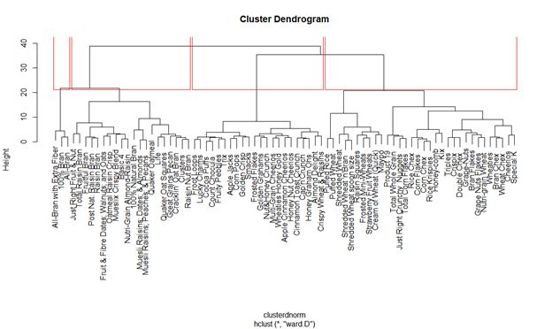
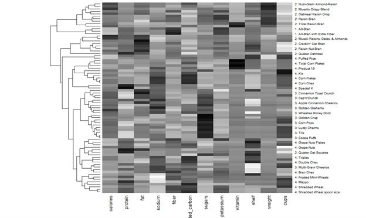
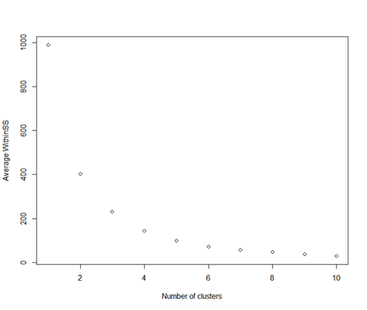
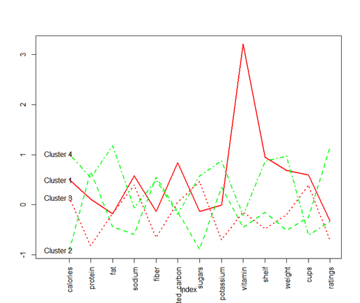
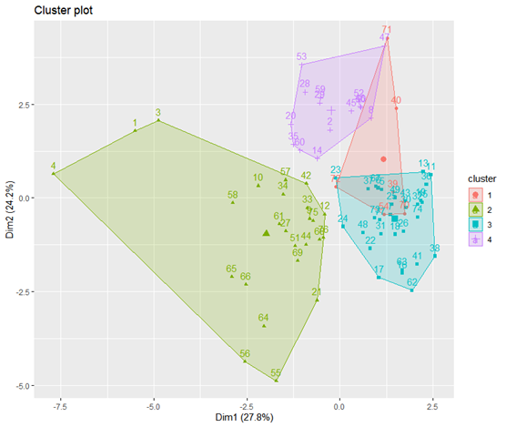

# Cluster-analysis-for-breakfast-cereals
The objective of this study is to help the company predict the future ratings of a new product based on its nutritional value and find a set of healthy cereals for schools’ cafeteria.

# About the Data
The data include 77 grain cereal details.  
The columns are like:
-	grain_name: Name of the edible grains.  
-	Producer: Manufacturer of the grains.  
o	A = Agra Food Products  
o	G = Green Light Foods  
o	K = Kellog’s Food Products.  
o	N = Nestle Products.  
o	P = Periyar Food Products  
o	Q = Quaker Oats  
o	R = Ran Impex Inc.  
- Variety:   
o	Cool  
o	Hot  
- Calories_content: calories per serving  
- Protein_content: protein content in grains in grams  
-	Fat_content: fat_content in grams.  
-	Hydrated_carbon: Carbohydrates present in grains in grams  
-	Sugars_content: grams of sugar  
-	Potassium content: milligrams of potassium  
-	Vit_&_min: Vitamins and minerals – 0, 25, or 100, indicating the typical percentage of FDA recommended.  
-	Shelf: display shelf (1, 2, or 3, counting from the floor)  
-	Weight: weight in grams of one serving  
-	Cups: number of cups in one serving  
-	Rating: A rating of the cereal (Possibly from Consumer Reports)  

# Summary
- There are 96% cereals are cold and 4% cereals are hot.
- Also, most cereal producers produce cool cereals as it is sweet and easier to be prepared. The most popular producer is Kellog’s Food Products and less popular is Agra Food Products. May be Agra Producer just started new business in cereal.
- I dropped some columns like Grain_name, Producer and Variety as they are categorical variable, and it is not meaningful when calculating distance.
- Now, there are a few negative values in dataset. Hence, I replaced all negative values with 0(zero).
- Also, as we have a different range of scales in variables and larger scale will dominate how cluster will be defined so, I normalized the data. 

After cleaning the data, let’s work on the clustering models.

# Clustering Models
## 1. Hierarchical clustering
I applied Hierarchical Agglomerative clustering with different methods and here is the representation: 

The different kind of methods in Hierarchical clustering are:
- single
- complete
- average
- ward D  
From all of these, I would prefer ward’s method as it seems more balanced than the other method. The objective of ward’s method is to minimize the within cluster SS. It is also better method in uncovering clusters of uneven physical sizes. 
Based on Hierarchical clustering, I found 4 clusters in the dataset on the base of the below dendrogram.  

Generate the heatmap to characterize the clusters:  

## 2. Kmeans
K-means is a very common non-hierarchical clustering model. I use "Average Within group SSE" to determine the number of clusters for k-means. Using the plot, we can use any value between 3-5 and according to me I choose k = 4 as my number of clusters. 

The centroids of the variables in the 4 clusters are shown:  

Now, I will use the number of k I got from above graph and do K-means clustering on my data set. The 2-D representation looks like: 

we need to determine the cluster (based on nutritional value) for schools cafeteria where set of cereals are healthy or not. Then determine the value of "rating" for each cluster. To do this, we need to run the following line: 
aggregate(cluster.df$ratings,by=list(cluster.df$ward),FUN=mean)  
aggregate(cluster.df$ratings,by=list(cluster.df$kmeans),FUN=mean  
|               | Cluster 1  | Cluster 2  | Cluster 3  | Cluster 4  |
| :-----------: |:----------:|:----------:|:----------:|:----------:|
| Kmeans        | 6 | 25 | 31 | 15 |
| Hierarchical  | 3 | 20 | 22 | 32 |

Looking at the aggregate of the above selected clusters in each method, we can clearly see that the cluster 2 in kmeans clustering method gives the highest rating for protein, fiber and potassium. Also, the cluster 4 in Hierarchical clustering method gives the highest rating for protein, hydrated carbon and vitamin.  

And that is how, we found our cluster to find set of healthy cereals for schools cafeteria and Producer will also know which factors are important to get higher ratings on their cereal products.  

I have used this dataset from Kaggle.com

Any suggestions or comments are welcome at priya.shah181@gmail.com

